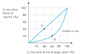
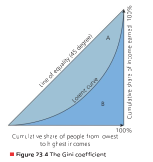

Economics of inequality and poverty
========================

**Equity** means economic fairness, such as those with higher levels of qualifications, skills and experience being paid more, that is, the existence of j ustified inequalities.

**Equality** means there is parity in income (earnings) between individuals, that is, everyone is paid or receives the same, so no inequalities exist.

**Unequal distribution of income** refers to imbalances of income distributions, that is, very few members of the society account for a disproportionately high concentration of national income.

**Unequal distribution of wealth**, also called a **wealth gap**, refers to imbalances in the spread of a country’s wealth among its citizens.

The **Lorenz curve** is a graphical representation of income distribution in a country, based on the income or wealth accounted for by each
decile or quintile of the population.

The **Gini coefficient** is a statistical tool that measures income or wealth inequality, with the outcome ranging from 0 (complete equality) to 1 (total inequality)

**Poverty** is the condition of an individual, household, community or country being extremely poor, that is, not being able to meet their basic human needs.

**Absolute poverty** exists when people are deprived of basic human needs for survival. People in absolute poverty suffer from malnutrition,
hunger, a lack of clean water, poor healthcare and inadequate shelter.

**Relative poverty** in a country refers to individuals and households who are unable to earn the minimum amount of income needed for them to maintain the average standard of living in the community or country.

Whether people live in absolute or relative poverty, there can be maj or negative consequences for these people and society as a whole. Examples of such problems include:

+ Low living standards
+ Lack of access to healthcare and education
+ Conflict and war
+ Poverty hinders the ability of governments to achieve other macroeconomic obj ectives such as economic growth and low unemployment.

An **international poverty line** is the minimum threshold level of income that a person must earn or have access to in order to meet the
basic needs necessary for human survival

The **national poverty line** is the level of income below which a person in the country cannot meet their basic minimum needs in terms
of shelter, nutritional level and clothing.

The **Minimum Income Standard (MIS)** measures the lowest amount of income needed for what members of the public in the country
think is acceptable to be able to live in a socially appropriate way.

**Multidimensional Poverty Index (MPI)** is a composite measure of poverty that identifies numerous deficiencies of individuals and households based on three dimensions or indicators of poverty – health, education and standards of living.

### Measuring poverty in a meaningful way is very challenging. Some of the other challenges are:

+ There have been discrepancies and debates regarding how the national poverty line of very poor countries would translate to the international poverty line for all nations. The International Poverty Line (IPL) is commonly used to measure if the people of the country have sufficient income to be able to meet their basic survival needs.
+ Relative poverty is a highly subj ective issue. Although most countries use absolute poverty to measure an individual’s or household’s ability to meet their day-to-day needs, a few countries prefer to measure this in terms of relative poverty line, that is, the percentage of the population with earnings less than a predetermined percentage of the median income within the country.
+ The nature of the low income is often ignored when measuring poverty. While economists and policymakers agree that the value of income is a useful indicator of poverty, a permanently low income (in poor countries) is not same as low income that is only in other countries that might be suffering from a short-term recession. A permanently low level of income creates a poverty trap, possibly for many generations to come.
+ There are limitations to the purchasing power parity figures used to compare international measures of poverty. This is because PPP values are likely to differ based on location (such as higher living costs in city centre locations) and time (as exchange rates tend to fluctuate over
time). This makes it more difficult to measure both absolute and relative poverty against an international poverty line.

### The main causes of economic inequality and poverty include the following:

+ inequality of opportunity
+ different levels of resource ownership
+ different levels of human capital
+ discrimination (gender, race and others)
+ unequal status and power
+ government tax and benefits policies
+ globalization and technological change
+ market-based supply-side policies.

**Inequality of opportunity** means that some individuals and societies have less or no access to employment and consumption opportunities so are deprived of economic prosperity

**Human capital** is the accumulation of skills, knowledge and experience of the workforce, viewed in terms of their value or cost

The World Economic Forum (WEF) uses the Global Gender Gap Index (GGGI) to quantify gender discrimination across different countries. The value of the GGGI ranges from 0 (indicating the highest possible gender gap) to 1.0 (indicating no gender gap or inequality). The WEF uses the
following parameters to calculate the GGGI:

+ Economic participation and opportunity
+ Educational attainment
+ Health and survival
+ Political empowerment.

**Globalization** is a multidimensional process of greater interaction and integration of goods, services, cultures, languages, social behaviours, business operations and governments worldwide.

### Market-based supply-side policies can create more inequality and poverty in the following ways:

+ Deregulation – the reduction or elimination of institutional powers in a country is intended to stimulate more competition in the economy, including competition from overseas companies. However, this could cause domestic businesses to collapse, thereby leading to further job losses (unemployment) and creating greater inequalities in the country.
+ Privatization – the transfer of ownership of property or businesses from the public sector to the private sector can also lead to unemployment and an uneven wealth distribution within the country. This is because privatized businesses are driven by profits, so will aim to cut costs in order to make efficiency gains.
+ Trade liberalization – freer and fairer international trade increases economic efficiency, but often leads to a wage gap between labourers because of the greater opportunities presented to the highly skilled workers. The resulting increase in wage differentials causes a widening of
income inequalities.
+ Anti-monopoly regulation – these are laws against anti-competitive behaviours in order to prevent abuse of monopoly power and to encourage competition. However, governments in low-income countries are not always able to prevent monopoly abuse, which then limits competition. Hence, the exploitative behaviour of large multinational companies with monopoly power often leads to increased inequalities in overseas
countries. For example, many multinational companies have been accused of exploiting workers in low-income countries by underpaying them and making them work long hours.

### The following are reasons why greater income inequality may be beneficial for a country:

+ High income and wealth inequality bring the possibility of higher income for those who work hard, which can create incentives for people to work harder thereby improving labour effort.
+ A prospect of earning higher incomes can encourage people to invest in their own education and skills development, thereby improving labour productivity.
+ Entrepreneurial instincts are encouraged as a result of the potential to earn higher profits. For example, firms may increase their investments in research and development and be more innovative.
+ Greater incentives and wealth creation can lead to a higher savings ratio. The increased savings ratio in the country can be used to fund investments, which generates an increase in the economy’s long-term growth and development.

### The following are reasons why greater income inequality may be detrimental to a country’s economic growth:

+ Greater income and wealth inequalities create more social tensions in the form of demonstrations, protests, political unrest and crime, which could lead to less investment and labour participation rates.
+ Greater inequalities usually lead to governments spending more on transfer payments in the form of unemployment benefits, employment generation schemes and other relevant expenditures to sustain the economy. However, transfer payments add to the burden of government debts and do not directly add to the national income of the country.
+ Inequalities can discourage workers from j oining the labour force and entrepreneurs of small and medium-sized businesses from investing in the economy. People are more likely to be voluntarily unemployed if there are large inequalities in incomes and a good welfare system that supports the unemployed. The inability of smaller firms to compete with large multinationals also causes demotivation for these entrepreneurs.

The **standard of living** in an economy indicates the extent to which people have the ability to lead a life that includes, but is not limited to, personal wealth and material comfort derived from having access to goods and services.

### The tax structure of a country must have the following characteristics in order to be effective:

+ Certainty – taxpayers must know what and when they need to pay, that is, the amount and the deadline of the tax due should be unquestionably clear, thereby limiting late payments and the number of tax evaders.
+ Convenience – the procedures and processes of paying taxes should be simple, that is, the methods and timing of tax payments should be made as easy as possible for people to pay.
+ Economic – taxes should be cost-effective for the authorities to collect, that is, the cost of collecting the tax should be a relatively small proportion of the tax yield.
+ Equitable – taxes should be levied according to the individual’s ability to pay, otherwise they create huge disincentive effects.

### Governments can use any of the following methods, funded by tax revenues, to reduce the level of inequalities in the economy:

+ Tax revenues enable the government to directly provide socially desirable goods and services, making these merit goods available to everyone, such as public education and healthcare services. Alternatively, the government may choose to use subsidies to enable firms to provide these merit goods and services.
+ The provision of essential infrastructure (such as sanitation and clean water supplies) helps to promote equity to those on low incomes and to help eradicate absolute poverty.
+ Transfer payments can be used to reduce income and wealth inequalities by making payments to the less affluent without any corresponding exchange or change in national output. Examples include:
+ + Retirement pensions (state pensions) – this is an income support scheme for elderly people beyond retirement age. The transfer payment is paid monthly to support this vulnerable group who may not otherwise have any other form of money.
+ + Unemployment benefits – these are transfer payments made to unemployed people to enable them to meet their basic human needs, while they actively seek employment opportunities.
+ + Child allowances (also known as child benefits) – these are welfare payments made to parents or guardians of children and teenagers in full-time education, for spending on items such as food, clothing, schooling, transportation and health check-ups.

A **progressive tax** charges a higher percentage tax as an individual’s income rises, that is, those who earn more pay a greater proportion of their income in tax

The **tax threshold** (or **tax allowance**) refers to the amount of income that workers can earn per year before they become liable for tax.

**Taxable income** is the amount of income that an individual or firm is liable to pay tax on, after taxable allowances have been accounted for.

A **proportional tax** (or a **flat rate tax**) charges the same percentage rate of tax, irrespective of the taxpayer’s level of income, wealth or profits.

A **regressive tax** applies a uniform tax rate to all taxpayers, thereby taking a larger percentage of income from low- income earners than from high-income earners.

The **marginal tax rate (MTR)** refers to the percentage of tax paid on the last dollar of an individual’s income, that is, the change in tax rate paid from a given change in income.

The **average rate of tax** refers to the amount of tax paid compared to the amount of income earned, that is, the total tax paid divided by the total income for an individual, or T ÷ Y.

A **direct tax** is a levy imposed on income, rather than on expenditure. It is imposed directly on the person or firm liable to pay the tax.

**Corporate income tax** (or **corporation tax**) is a direct tax imposed on the annual profits of private sector businesses

A **wealth tax** is direct tax based on the market value of assets owned by an individual, household or firm.

An **indirect tax** (also known as an **expenditure tax**) is a government levy on consumption, rather than being imposed on incomes. Examples of indirect taxes include Goods and Services Tax (GST), customs duties (imposed on imported products) and excise duties (imposed on demerit goods).

###  Policies to reduce inequalities of opportunities/investment in human capital

+ Increase the minimum wage in a country, which could lead to the eradication of poverty owing to higher incomes for low-waged labourers. This could also help to improve their household’s access to education and healthcare.
+ In many countries, the Earned Income Tax Credit (EITC) scheme gives tax benefits for working people with low to moderate income, who have children. The EITC scheme reduces the amount of tax these households pay, and some households even qualify for a tax refund. This has been an effective tool to increase income and reduce poverty. Policymakers suggest that other countries could also adopt such a policy, offering tax credits to low- and middle- income families who do not have any children.
+ An investment in early education could help to facilitate labour productivity and economic mobility in the long-term. Essentially, investments in the country’s human capital contribute to reducing or removing inequalities of economic opportunities.
+ Appropriate tax reforms including more progressive taxes could lead to higher government tax revenues without hurting lower income families. The extra revenue would be used to ensure a reduction in income and wealth inequalities, and greater access to economic opportunities for
lower- and middle-income families.
+ Policies to encourage housing for low-income families could lower residential and social segregation by income and race, which can boost economic mobility for all members of society. Again, this helps to reduce inequality of opportunities.

A **transfer payment** is a sum of money from the government to another party for which no goods or services are being paid, that is, there is no corresponding output or economic activity for such payments.

A **universal basic income (UBI)** refers to the guaranteed minimum level of income that a government guarantees to each individual of the
country.

### Anti-discrimination legislation  helps the country to tackle issues of poverty, social deprivation and unemployment. There are three distinct steps in achieving this:

1)  Setting a commonly agreed standard for individual and collective behaviour towards any form of discrimination.
2)  Educating the public about the standards expected within a society.
3)  Establishing deterrents and consequences for those who violate the standards.

A **minimum wage** is the lowest rate of pay that firms must pay to their employees per time period, as stipulated by the government.

