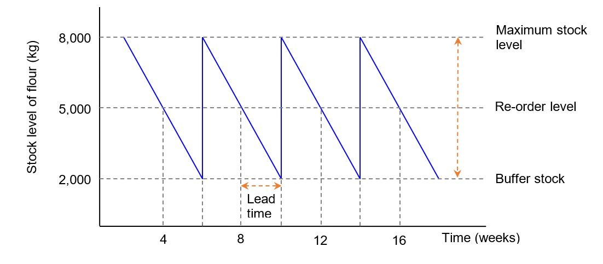

Stock control charts
========================

There are three types of stock (or inventory):

- **Raw materials** - the natural resources for use in the production process.

- **Semi-finished goods** (also referred to as **work-in-progress**) - these are incomplete units of output, and

- **Finished goods** - the completed products that are ready to be sold to consumers.

An important aspect of **just-in-case (JIC)** is stock control.  A **stock control chart** is a visual tool used to monitor and analyse a firm’s stock levels.  It shows the rate at which stocks are used,  when stocks are order,  how long they take to be distributed, and when they are delivered.  A stock control chart enables operations managers to make more-informed decisions about how best to manage their stock levels.

The main aspects of a stock control chart are:

- The **maximum stock level** – this is the most amount of stock that a firm wants to hold at any point in time,  given its storage facilities and capacity. In the diagram below, the firm’s maximum stock level is 8,000 kilos of flour.

- The **buffer stock** – this is the minimum stock level that a firm wishes to hold at any point in time.  Buffer stocks are used just in case there is an unexpected increase in orders from customers,  late deliveries from suppliers,  or damaged stocks.  Firms might also use buffer stocks to offset price fluctuations. I n the diagram below,  the buffer stock is 2,000 kgs of flour.

- The **reorder level** – this is the level of inventory when a firm is required to reorder its stock.  This ensures new stock is delivered in time before stocks run out.  In the diagram below,  the firm places a new order when its stock level reaches 5,000 kgs of flour.

- The **reorder quantity** – this is the amount of new stock that is ordered for production.  This is calculated by using the formula Reorder quantity = Maximum stock level – Buffer stock In the diagram below,  the reorder quantity is 6,000 kilos of flour (i.e. 8,000 kg – 2,000 kg).

- The **usage rate** – this shows the speed (rate) at which stocks are used in the production process. This is calculated by using formula Usage rate per time period = Stocks used / Time period.  In the diagram below,  it can be seen that 6,000 kilos are used in a four week period,  i.e.,  the usage rate is 1,500 kilos per week.

- **Lead time** – this is the timeframe (or time lag) from when a firm places an order for stock and it receiving delivery of the stock,  i.e.,  how long it takes for a supplier to make a delivery from the time of placing an order.  It is calculated by the difference between the time of placing the order (once the re-order quantity is reached) and the time of delivery.  In the diagram below,  the lead time is 2 weeks.

The longer the lead time,  the earlier the reorder needs to be and/or the larger the reorder amount needs to be. By contrast,  the shorter the lead time,  the lower the buffer stock level needs to be.  Any delays in the lead time (the period of time taken for a supplier to process and deliver a stock order) will mean that stock levels fall below the desired minimum level,  so the firm has to rely on its buffer stock.  If lead times are short, lower buffer stock levels can be held as the producer knows new stock orders will be delivered soon (preventing significant delays to production).

The main drawback of using stock control charts is that it is rather simplistic,  so does not present things in reality.  Actual stock control graphs look rather different due to,  for example,  late deliveries,  seasonal fluctuations in demand,  and production delays.