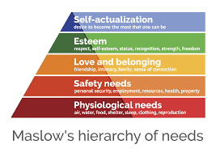

Motivational Theories SL
========================

| Taylor | Maslow | Herzberg |
| ----- | ----- | ----- |
|    <ul> <li>Economic man</li>  <li>Scientific method</li>  <li>A fair pay for a fair work</li> <li>No involvement of workers</li></ul>   | **Piramid of values**    When an individual has one need satisfied, he will focus to satisfy the upper one in the piramid scale       Individuals have different scale of values|  **Motivator factors** When present give satisfaction    **Hygiene factors**   When missing give dissatisfaction      Motivators and Hygiene factors do not balance each other.    **Motivator factors** <ul> <li>Achievement</li><li>Advancement</li><li>Challenging work</li><li>Decision Making</li><li>Nature of job</li><li>Opportunities to improve</li><li>Personal growth</li><li>Purpose</li><li>Recognition of achievement</li><li>Responsibility</li></ul> **Hygiene factors**<ul> <li>Company policies</li><li>Conditions of employment</li> <li>Job security</li><li>Pay (wages and salaries)</li><li>Relationship with colleagues</li><li>Relationship with management</li><li>Status</li><li>Supervision</li><li>Treatment at work</li><li>Working environment</li></ul>|

