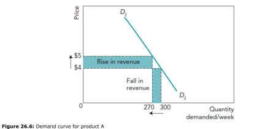
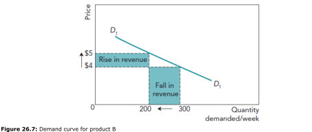

Price Elasticity of Demand
========================

Pricing decisions should be based on as much up-to-date and relevant information as possible. A key piece of information in pricing decisions is how demand is likely to respond to a change in price. Marketing departments try hard to assess the impact that changes in the price of a product will have on demand for it.  A form of measurement has been developed to help in this assessment. It is called price elasticity of demand.

Look at the two demand curves in Figures 26.6 and 26.7. D2D2 has a steeper gradient that D1D1. What impact does the slope or gradient of the curves have on the demand levels for these two products when prices are changed? You will notice that, when theprice of both products is increased by the same amount, the reduction in demand is greater for product B than it is for product A. This could be important information for the marketing manager because the total revenue for product A has actually increased, but for B it has fallen,m as can be seen by the size of the shaded areas.

This relationship between prices changes and the size of the resulting change in demand is known as **price elasticity of demand**.

## Formula

`PED = percentage change in quantity demanded / percentage change in price`

The value of PED is normally negative because a fall in price (-ve) usually results in a rise in demand (+ve). Similarly, a rise in price (+ve) results in a fall in demand (-ve). This is called an inverse relationship. It is quite common to ignore the negative sign of the PED result, as it is the numerical value of the result that is important.

## Factors that determine price elasticity of demand

+ **How necessary the product is**. The more necessary consumers consider a product to be, the less they will react to price changes. This will tend to make the demand inelastic, as is the case with sald and cooking oil.
+ **Number of close competitors**. If there are many competitors then there are a large number of substitutes. Consumers will quickly switch to another brand if the price of one manufacturer's product increases (e.g., fruit being sold by one seller in a large street market). Any decision by a business to reduce the number of competing products, such as a merger or a takeover, will probably made demand for its own products less elastic.
+ **Consumer loyalty**. If a firm has a successfully branded its product to create a high degree of loyalty amoung consumders, like Coca-Cola, then the consumers will be likely to continue buying the product following a price rise. Another example of this is designer clothes that have a strong following high income consumers, even when prices rise. All businesses attempt to increase brand loyalty with influential advertising and promotional campaigns and by making their products more distinct. This is called product differentiation.
+ **Price of the product as a proportion of consumers' incomes**. A cheap product that takes up a small proportion of consumers' income, such as matches or batteries, is likely to have inelastic demand, as consumders will not be greately affected by a 10% or 15% prince increase.

## Prices elasticity of demand - uses in business

+ **Making more accurate sales forecasts**. If a business is considering a price increase, perhaps to cover rises in production costs, the an awaress of PED allows a forecast of likely demand changes to be calculated. For instance, if PED is believed to be -0.8 and the price is increased by 10$, what will be the new weekly sales level if it is currently 10.000 per week? Demand will fall by 8% (check this out using the PED formula) and this will give a forecast sales level of 9.200 per week,.
+ **Impact on pricing decisions**. If an operator of bus services is considering changing its pricing structure, then knowing the PED on different routes will help. It could increase prices on routes with low PED (inelastic demand) and reduce them on routes with high PED (elastic demand). These decisions will increase the total revenue of the bus operator.

If a business is planning to use a premium pricing, it would be assuming that demand is relatively price inelastic so that the high price will not result in a proportionately greater reducion in demand. Revenue should increase if demand is price inelastic.

If a business is planning use penetration pricing, it would be assuing that demand is relatively price elastic so taht the low price results in a proportionately greater increase in demand. Revenue should increase if demand is relatively price elastic.

### Evaluation of price elasticity of demand

PED has its uses,, but the concept and the results gained from it must be used with caution. It has three main limitations:

+ PED assumes that nothing else has changed. If Business A reduces the price for a product by 10%, it will expect sales to increase because of this. However, if, at about the same time, a competitor leaves the industry and consumer incomes rise, the resulting increase in sales of Business A's product may be substantial, but *not just* because of the price reduction. Calculating PED accurately inthese and similar situations where other changes occur will be almost impossible.
+ A PED calculation, even when calculated when nothing but price changes, will become outdated quickly. It may need to be recalculated often, because over time consumer tastes change and new competitors may bring in new products. Last year's PED calculation may be very different to one calculated today if market conditions have changed.
+ It is not always easy, or indeed possible, to calculate PED. The data needed for working it out might come from past sales results following previous price  changes. This data could be quite old and market conditions might have changed. In the case of new products, market research will have to be relied upon to estimated PED. This is done by trying to identify the quantities that a sample of potential customers would purchase at different prices. This will be subject to the same kind of innacuracy as other forms of market research.
 